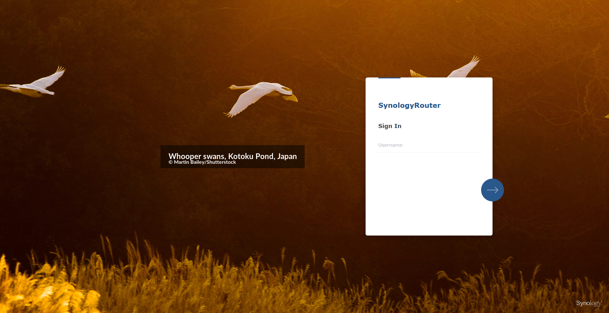
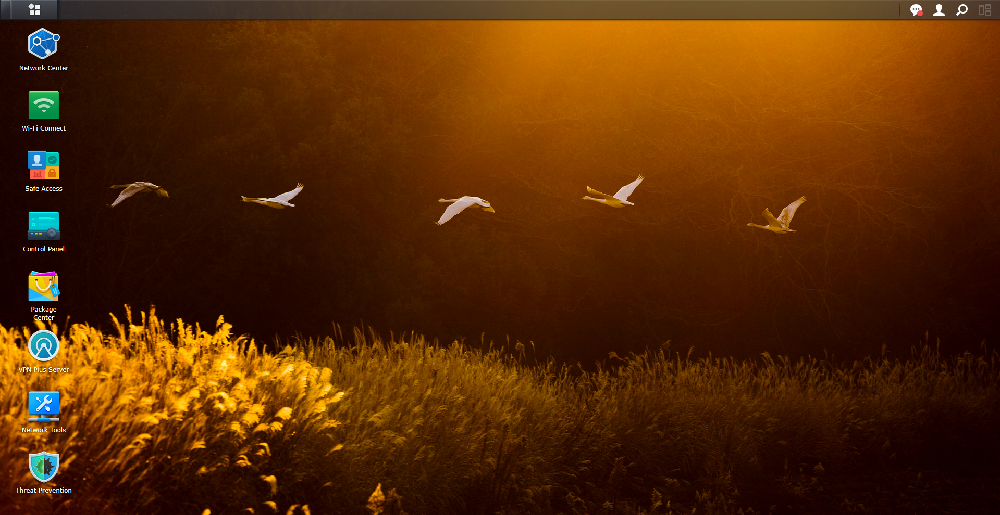

# Synology SRM 1.3 Bing Wallpaper Auto-Update

[](https://github.com/ventura8/Synology-SRM-Bing-Wallpaper-Auto-update) 

Automatically downloads the daily Bing wallpaper and sets it as the login background and default wallpaper on Synology SRM 1.3 (Router Manager).

## 🚀 Quick Start (One-Line Install)
SSH into your router and run:

```sh
wget -O - https://raw.githubusercontent.com/ventura8/Synology-SRM-Bing-Wallpaper-Auto-update/main/install.sh | sudo sh
```


## 🚀 Features
- **SRM 1.3 Compatible**: Specifically targeted for the layout of Synology Routers (RT6600ax, RT2600ac, MR2200ac).
- **Automated Scheduling**: Automatically sets up a daily cron job (no GUI required).
- **Smart Detection**: Dynamically finds and updates the correct wallpaper resource file.
- **4K Support**: Downloads high-resolution UHD images.
- **Metadata**: Extracts Title and Copyright info (Optionally sets them as welcome message - *Requires configuring synoinfo*).
- **Archiving**: Option to save a history of wallpapers.

## 📸 Screenshots

| Login Screen | Desktop Environment View |
| :---- | :---- |
|  |  |
| *Fresh daily look from the moment you log in* | *Beautiful daily landscapes on your desktop* |

## Supported Region Codes:
| Code | Region | Code | Region |
| :--- | :--- | :--- | :--- |
| en-WW | Worldwide | en-IN | India |
| en-US | USA | it-IT | Italy |
| en-AU | Australia | ja-JP | Japan |
| pt-BR | Brazil | en-NZ | New Zealand |
| en-CA | Canada | es-ES | Spain |
| zh-CN | China | en-GB | England (UK) |
| fr-FR | France | en-SG | Singapore |
| de-DE | Germany | | |

## 🛠️ Prerequisites (Enable SSH)
Before installing, you must enable SSH to access the router's command line:
1.  Log in to SRM.
2.  Go to **Control Panel > Services > System Services > Terminal**.
3.  Check **Enable SSH service**.
4.  Click **Apply**.

## 📦 Installation

### One-Line Installer (Recommended)
SSH into your router and run:

```sh
wget -O - https://raw.githubusercontent.com/ventura8/Synology-SRM-Bing-Wallpaper-Auto-update/main/install.sh | sudo sh
```

### Custom Schedule
The installer runs an **interactive wizard** that asks you for:
1.  **Resolution**: 4K (UHD) or 1080p (FHD).
2.  **Bing Region**: (e.g., Worldwide, USA, UK, etc.).
3.  **Text Overlay**: Enable/Disable Title & Copyright overlay on the login screen.
4.  **Schedule**: Change the default time (10:00).

You can also pre-set the time variables for automated installs:

```sh
# Example: Run at 8:30 AM
wget -O - https://raw.githubusercontent.com/ventura8/Synology-SRM-Bing-Wallpaper-Auto-update/main/install.sh | sudo CRON_HOUR=8 CRON_MIN=30 sh
```

This will:
1.  Download the script to `/usr/local/bin/`.
2.  **Prompt you** for configuration options.
3.  Make it executable.
4.  **Automatically schedule it** to run daily via `/etc/crontab`.

### 🗑️ Uninstallation

To remove the script and the automated schedule:

1.  SSH into your router.
2.  Run the uninstaller:
    ```bash
    wget -O - https://raw.githubusercontent.com/ventura8/Synology-SRM-Bing-Wallpaper-Auto-update/main/uninstall.sh | sudo sh
    ```

### Manual Installation
1.  Download `bing_wallpaper_auto_update.sh`.
2.  Upload it to your router (e.g., `/usr/local/bin/`).
3.  Make it executable: `chmod +x bing_wallpaper_auto_update.sh`.
4.  Run it to test: `./bing_wallpaper_auto_update.sh`.

## 📅 Scheduling
The installer automatically sets up a daily cron job.
To verify, you can check the crontab file:

```sh
cat /etc/crontab
# You should see: 0 10 * * * root /usr/local/bin/bing_wallpaper_auto_update.sh
```

## ⚙️ Customization
Open the script and edit the Configuration section:
-   `BING_RESOLUTION`: "4k" or "1080p"
-   `BING_MARKET`: Region code (e.g., "en-US", "zh-CN", "ja-JP")
-   `ENABLE_ARCHIVE`: true/false (saves wallpaper history)
-   `SAVE_PATH`: Directory to save history
-   `SET_WELCOME_MSG`: true/false (displays title & copyright on login screen - **DSM only, not supported on SRM**)
-   `BURN_TEXT_OVERLAY`: true/false (overlays title & copyright text directly on the wallpaper image)
    -   **Responsive Layout**: Automatically sizes text box based on image width (4K/1080p).
    -   **Position**: Vertically centered, standard left offset.
    -   **Smart Trimming**: Uses `BorderGuard` to prevent text clipping while shrinking the background box to fit content.
    -   **Separation**: Applied ONLY to Login Screen; Desktop wallpaper remains clean.

## DISCLAIMER
This script modifies system files (`/usr/syno/etc/login_background.jpg`). Use at your own risk.
